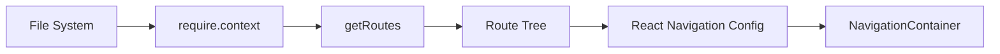
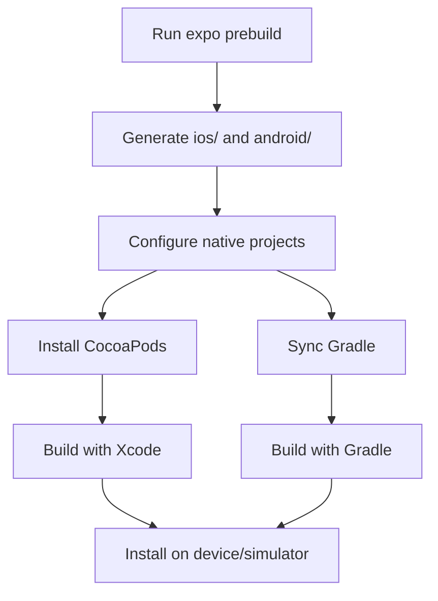
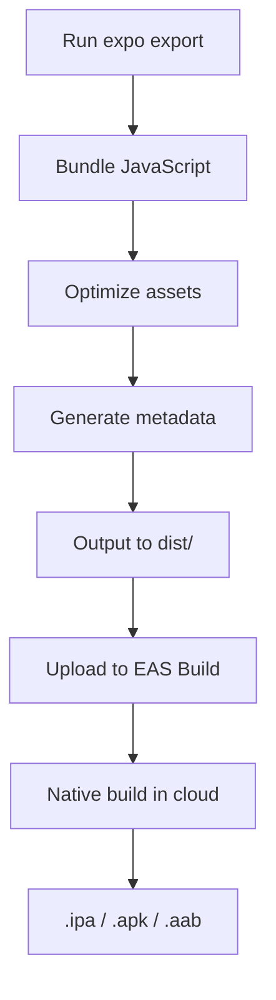

Expo is built as a layered architecture on top of React Native, providing tools, libraries, and services that make cross-platform development seamless. This guide explains how all the pieces fit together.

## High-Level Architecture

Expo consists of several interconnected components:

```mermaid
graph TB
    A[Your React App] --> B[Expo SDK]
    A --> C[Expo Router]
    B --> D[expo-modules-core]
    D --> E[React Native]
    E --> F[iOS Native]
    E --> G[Android Native]
    E --> H[React Native Web]
    I[@expo/cli] --> J[Metro Bundler]
    I --> K[Native Build Tools]
    J --> A
    K --> F
    K --> G
```

## Core Components

### 1. Expo SDK

The Expo SDK is a collection of 50+ JavaScript libraries that provide access to native device capabilities. Each library is a separate npm package.

**Key SDK Modules:**

<CardGroup cols={2}>
  <Card title="Core Modules" icon="cube">
    - `expo-asset` - Asset loading system
    - `expo-constants` - App manifest constants
    - `expo-file-system` - File operations
    - `expo-font` - Custom font loading
  </Card>
  
  <Card title="Device Features" icon="mobile">
    - `expo-camera` - Camera access
    - `expo-location` - GPS and location
    - `expo-sensors` - Accelerometer, gyroscope
    - `expo-battery` - Battery status
  </Card>
  
  <Card title="UI Components" icon="paintbrush">
    - `expo-blur` - Blur effects
    - `expo-glass-effect` - Glass morphism
    - `expo-symbols` - SF Symbols (iOS)
    - `expo-image` - Optimized images
  </Card>
  
  <Card title="Network & Storage" icon="database">
    - `expo-network` - Network info
    - `expo-secure-store` - Encrypted storage
    - `expo-sqlite` - SQLite database
    - `expo-auth-session` - OAuth flows
  </Card>
</CardGroup>

**SDK Package Structure:**

The main `expo` package bundles essential modules:

```json package.json (from expo package)
{
  "name": "expo",
  "version": "55.0.0",
  "dependencies": {
    "expo-modules-core": "55.0.9",
    "expo-modules-autolinking": "55.0.5",
    "expo-asset": "~55.0.5",
    "expo-constants": "~55.0.5",
    "expo-file-system": "~55.0.6",
    "expo-font": "~55.0.4",
    "@expo/cli": "55.0.9"
  }
}
```

### 2. Expo Modules Core

`expo-modules-core` is the foundation that enables writing native modules that work seamlessly across iOS and Android. It provides:

- **Unified Native API**: Write native code once, works on both platforms
- **Autolinking**: Automatic native module discovery and linking
- **Type Safety**: Generated TypeScript types from native code
- **Module Registration**: Automatic module registration in the runtime

**How it works:**

1. Native code is written using the Expo Modules API (Swift for iOS, Kotlin for Android)
2. Autolinking discovers modules at build time
3. Modules are automatically registered with React Native
4. JavaScript can import and use the module immediately

**Example Module Structure:**

```bash
expo-camera/
├── android/
│   └── src/main/java/expo/modules/camera/
│       └── CameraModule.kt
├── ios/
│   └── CameraModule.swift
├── src/
│   └── Camera.tsx
└── expo-module.config.json
```

<Info>
  For details on creating modules, see the [Expo Modules documentation](/core-concepts/expo-modules).
</Info>

### 3. Expo CLI

The `@expo/cli` package is the command-line interface for Expo. It provides:

**Development Commands:**
- `expo start` - Start Metro bundler and dev server
- `expo run:ios` - Build and run on iOS
- `expo run:android` - Build and run on Android

**Build Commands:**
- `expo prebuild` - Generate native projects
- `expo export` - Export for production

**Utility Commands:**
- `expo install` - Install compatible packages
- `expo config` - View merged app configuration
- `expo customize` - Customize Metro config

**CLI Architecture:**

The CLI is structured as a collection of command modules:

```bash
@expo/cli/src/
├── start/              # Development server
│   ├── server/
│   │   ├── metro/          # Metro integration
│   │   └── middleware/     # HTTP middleware
│   └── platforms/      # Platform launchers
├── run/                # Native build commands
│   ├── ios/
│   └── android/
├── prebuild/          # Native project generation
├── export/            # Production bundling
└── install/           # Package management
```

### 4. Expo Router

Expo Router provides file-based routing for React Native apps. It's built on React Navigation but uses your file structure to automatically generate navigation.

**Router Architecture:**



**Key Concepts:**

1. **File-Based Routes**: Files in `app/` become routes
2. **Layouts**: `_layout.tsx` files define navigation structure
3. **Dynamic Routes**: `[param].tsx` for dynamic segments
4. **Groups**: `(group)` folders organize without affecting URLs
5. **Type Safety**: Automatic TypeScript types for routes

**Example Routing:**

```bash
app/
  _layout.tsx         # Root layout with tabs
  index.tsx           # / route
  profile/
    _layout.tsx       # Profile layout with stack
    [id].tsx          # /profile/:id route
  (auth)/
    login.tsx         # /login route (group hidden in URL)
    register.tsx      # /register route
```

<Info>
  Learn more about routing in the [Development Workflow guide](/core-concepts/development-workflow).
</Info>

### 5. Metro Bundler

Metro is the JavaScript bundler that transforms and bundles your code. Expo integrates Metro with enhancements:

**Metro's Role:**

1. **Transformation**: Converts TypeScript/JSX to JavaScript
2. **Bundling**: Combines modules into optimized bundles
3. **Code Splitting**: Separates code for different platforms
4. **Fast Refresh**: Updates app without losing state

**Expo's Metro Enhancements:**

- Multi-platform support (iOS, Android, Web)
- Asset handling (images, fonts, etc.)
- Environment variable support
- Web compatibility shims
- Server-side rendering support

**Configuration:**

Expo provides a pre-configured Metro setup:

```javascript metro.config.js
const { getDefaultConfig } = require('expo/metro-config');

const config = getDefaultConfig(__dirname);

module.exports = config;
```

### 6. React Native

At the foundation, Expo builds on React Native, which provides:

- **JavaScript Runtime**: Hermes (default) or JSC
- **Bridge**: Communication between JS and native
- **Native Components**: View, Text, Image, etc.
- **Native Modules**: Platform APIs

**Expo's React Native Version:**

Expo includes specific React Native versions tested for compatibility:

```json
{
  "react": "19.2.0",
  "react-native": "0.83.2"
}
```

## Development Workflow

### How Development Server Works

When you run `npx expo start`:

<Steps>

<Step title="CLI starts Metro">
  The CLI launches Metro bundler on port 8081
</Step>

<Step title="Dev server starts">
  HTTP server starts to serve manifests and assets
</Step>

<Step title="QR code displayed">
  Terminal shows QR code with connection URL
</Step>

<Step title="App connects">
  Your app (Expo Go or dev build) connects to the server
</Step>

<Step title="Manifest sent">
  Server sends app configuration and bundle URL
</Step>

<Step title="Bundle loaded">
  App downloads and executes JavaScript bundle
</Step>

<Step title="Fast Refresh enabled">
  File changes trigger hot reloads
</Step>

</Steps>

### Build Process

**Development Build Process:**



**Production Build Process:**



## Configuration System

Expo uses a layered configuration system:

### app.json / app.config.js

Your app's configuration file defines:

```json app.json
{
  "expo": {
    "name": "MyApp",
    "slug": "my-app",
    "version": "1.0.0",
    "platforms": ["ios", "android", "web"],
    "ios": {
      "bundleIdentifier": "com.company.myapp",
      "buildNumber": "1"
    },
    "android": {
      "package": "com.company.myapp",
      "versionCode": 1
    },
    "plugins": [
      "expo-router",
      [
        "expo-camera",
        {
          "cameraPermission": "Allow $(PRODUCT_NAME) to access your camera"
        }
      ]
    ]
  }
}
```

### Config Plugins

Config plugins modify native projects during `expo prebuild`:

```javascript app.config.js
module.exports = {
  expo: {
    plugins: [
      // Plugin with options
      ['expo-camera', {
        cameraPermission: 'Allow camera access'
      }],
      // Custom plugin
      './plugins/my-plugin.js'
    ]
  }
};
```

**What plugins can do:**

- Modify iOS Info.plist and Podfile
- Modify Android AndroidManifest.xml and build.gradle
- Add native dependencies
- Configure permissions
- Add entitlements

## Autolinking

Autolinking automatically configures native dependencies:

**How it works:**

1. Install package: `npx expo install expo-camera`
2. Autolinking runs during build
3. Scans `node_modules` for Expo modules
4. Generates native configuration
5. Registers modules in app

**iOS Autolinking (Podfile):**

```ruby Podfile
require File.join(File.dirname(`node --print "require.resolve('expo-modules-core/package.json')"`), "cocoapods.rb")
require File.join(File.dirname(`node --print "require.resolve('expo-modules-core/package.json')"`), "scripts/autolinking")

target 'MyApp' do
  use_unimodules!
  # Expo modules are automatically linked
end
```

**Android Autolinking (settings.gradle):**

```groovy settings.gradle
apply from: new File(["node", "--print", "require.resolve('expo-modules-core/package.json')"].execute(null, rootDir).text.trim(), "../gradle.groovy");
includeUnimodulesProjects()
```

## Platform Differences

Expo handles platform differences through:

### File Extensions

```bash
Component.tsx         # All platforms
Component.ios.tsx     # iOS only
Component.android.tsx # Android only
Component.web.tsx     # Web only
Component.native.tsx  # iOS + Android
```

### Platform Module

```typescript
import { Platform } from 'react-native';

const styles = StyleSheet.create({
  container: {
    paddingTop: Platform.OS === 'ios' ? 20 : 0,
    ...Platform.select({
      ios: { shadowColor: '#000' },
      android: { elevation: 4 },
      web: { boxShadow: '0 2px 4px rgba(0,0,0,0.2)' }
    })
  }
});
```

### Conditional Imports

```typescript
import { Camera } from 'expo-camera';

if (Platform.OS !== 'web') {
  // Use camera
}
```

## Performance Optimizations

Expo includes several performance optimizations:

### Hermes Engine

Hermes is enabled by default for faster startup:

```json app.json
{
  "expo": {
    "jsEngine": "hermes"
  }
}
```

### Bundle Splitting

Metro splits bundles by platform:

```
app.bundle         # Shared code
app.ios.bundle     # iOS-specific
app.android.bundle # Android-specific
```

### Asset Optimization

Assets are automatically optimized:

- Images: Compressed and sized appropriately
- Fonts: Subsetted when possible
- Videos: Served with proper MIME types

## Summary

<CardGroup cols={2}>
  <Card title="Expo SDK" icon="cube">
    JavaScript libraries for device features, built on expo-modules-core
  </Card>
  
  <Card title="Expo CLI" icon="terminal">
    Command-line tools for development, building, and deployment
  </Card>
  
  <Card title="Expo Router" icon="route">
    File-based routing built on React Navigation
  </Card>
  
  <Card title="Metro Bundler" icon="box">
    JavaScript bundler with multi-platform support
  </Card>
</CardGroup>

## Next Steps

<CardGroup cols={2}>
  <Card title="Expo Modules" icon="puzzle-piece" href="/core-concepts/expo-modules">
    Learn how native modules work
  </Card>
  
  <Card title="Development Workflow" icon="code" href="/core-concepts/development-workflow">
    Understand the development cycle
  </Card>
  
  <Card title="Expo Go" icon="mobile" href="/core-concepts/expo-go">
    Learn about the Expo Go app
  </Card>
  
  <Card title="Tutorial" icon="graduation-cap" href="/tutorial/create-project">
    Build your first app
  </Card>
</CardGroup>
