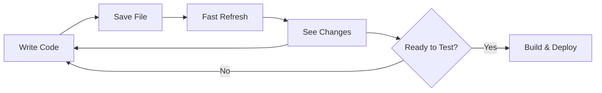

Expo provides a streamlined development workflow with fast iteration, instant previews, and powerful debugging tools. This guide covers the complete development cycle from writing code to seeing it run on devices.

## Development Cycle Overview



## Starting Development

### Launch Dev Server

Start the development server with:

<CodeGroup>

```bash Basic start
npx expo start
```

```bash Clear cache
npx expo start --clear
```

```bash Specific platform
npx expo start --ios
npx expo start --android
npx expo start --web
```

```bash Tunnel (for different networks)
npx expo start --tunnel
```

</CodeGroup>

### What Happens When You Start

<Steps>

<Step title="Metro Bundler Starts">
  Metro bundler launches on port 8081, ready to transform and bundle your JavaScript
</Step>

<Step title="Dev Server Starts">
  HTTP server starts to serve:
  - App manifest (configuration)
  - JavaScript bundles
  - Source maps
  - Assets (images, fonts)
</Step>

<Step title="QR Code Displayed">
  Terminal shows QR code and connection options:
  ```bash
  › Metro waiting on exp://192.168.1.100:8081
  › Scan the QR code above
  
  › Press a │ open Android
  › Press i │ open iOS simulator  
  › Press w │ open web
  ```
</Step>

<Step title="Ready for Connections">
  Devices can now connect via:
  - QR code scan
  - Direct URL entry
  - Automatic launch (simulators)
</Step>

</Steps>

## Fast Refresh

Fast Refresh updates your app instantly when you save files, preserving component state.

### How Fast Refresh Works

<Steps>

<Step title="File Changes Detected">
  Watchman detects file modifications
</Step>

<Step title="Module Transformed">
  Metro transforms only the changed module
</Step>

<Step title="Hot Update Sent">
  Update is sent via WebSocket to connected devices
</Step>

<Step title="Component Re-renders">
  React re-renders the component, preserving state
</Step>

</Steps>

### What Gets Preserved

<Check>
  **Preserved during Fast Refresh:**
  - Component state (useState, useReducer)
  - Navigation state
  - Form inputs
  - Scroll position
</Check>

<Warning>
  **Triggers Full Reload:**
  - Changes to files outside `app/` or `src/`
  - Native module changes
  - app.json modifications
  - New dependencies installed
</Warning>

### Example: Fast Refresh in Action

```tsx app/index.tsx
import { useState } from 'react';
import { View, Text, Button } from 'react-native';

export default function HomeScreen() {
  const [count, setCount] = useState(0);

  return (
    <View>
      <Text>Count: {count}</Text>
      <Button title="Increment" onPress={() => setCount(count + 1)} />
      
      {/* Change this text and save - count state is preserved! */}
      <Text>Hello from Expo</Text>
    </View>
  );
}
```

When you edit the `<Text>` content and save, the change appears instantly without resetting `count`.

## Development Server Features

### Interactive Terminal

While the dev server is running, you can:

| Key | Action |
|-----|--------|
| `a` | Open on Android emulator/device |
| `i` | Open on iOS simulator |
| `w` | Open in web browser |
| `r` | Reload app |
| `m` | Toggle developer menu |
| `c` | Show project QR code |
| `j` | Open React DevTools (web) |
| `o` | Open project in editor |

### Developer Menu

Access the developer menu:

- **iOS Simulator**: Cmd+D
- **Android Emulator**: Cmd+M (Mac) or Ctrl+M (Windows/Linux)
- **Physical Device**: Shake the device
- **Terminal**: Press `m`

**Menu Options:**

- Reload
- Debug Remote JS (legacy)
- Enable Fast Refresh
- Toggle Element Inspector
- Toggle Performance Monitor
- Open React DevTools

### Element Inspector

Inspect UI elements in your app:

1. Open developer menu
2. Select "Toggle Element Inspector"
3. Tap any element to see its properties

```bash
View > View > Text
Props: style, children
Position: x: 20, y: 100
Size: 200 x 50
```

### Performance Monitor

Monitor app performance:

1. Open developer menu
2. Select "Toggle Performance Monitor"
3. View real-time metrics:
   - JS thread FPS
   - UI thread FPS  
   - RAM usage
   - Bridge traffic

## Metro Bundler

Metro is the JavaScript bundler that powers Expo development.

### Metro Configuration

Customize Metro in `metro.config.js`:

```javascript metro.config.js
const { getDefaultConfig } = require('expo/metro-config');

const config = getDefaultConfig(__dirname);

// Add support for additional file extensions
config.resolver.assetExts.push('db');

// Add custom source extensions
config.resolver.sourceExts.push('mjs');

// Configure transformer
config.transformer.minifierPath = 'metro-minify-terser';

module.exports = config;
```

### Metro Commands

<CodeGroup>

```bash Clear cache
npx expo start --clear
```

```bash Reset bundler
npx expo start --reset-cache
```

```bash Production mode
npx expo start --no-dev --minify
```

</CodeGroup>

### Asset Handling

Metro automatically handles:

**Images:**
```tsx
import logo from './assets/logo.png';

<Image source={logo} />
```

**Fonts:**
```tsx
import { useFonts } from 'expo-font';

const [fontsLoaded] = useFonts({
  'Inter-Black': require('./assets/fonts/Inter-Black.otf'),
});
```

**Other Assets:**
```tsx
import data from './assets/data.json';
import doc from './assets/document.pdf';
```

## Build Types

### Development Builds

Development builds include your exact dependencies and allow for custom native code.

**When to use:**
- Need custom native modules
- Using libraries not in Expo Go
- Configuring native project settings
- Testing production-like behavior

**Creating a development build:**

```bash
# Local build
npx expo prebuild
npx expo run:ios
npx expo run:android

# Cloud build with EAS
eas build --profile development
```

### Expo Go Builds

Expo Go is a pre-built app with common SDK modules.

**When to use:**
- Learning Expo
- Prototyping quickly
- Only using Expo SDK modules
- Sharing demos

**Limitations:**
- No custom native code
- Limited to included SDK modules
- Some libraries incompatible

<Accordion title="What's included in Expo Go?">

Expo Go includes these SDK modules:

- Camera, Location, Sensors
- FileSystem, SQLite, SecureStore
- Notifications, Updates
- Image Picker, Document Picker
- Video, Audio, AV
- And 40+ more...

See [full list](https://docs.expo.dev/versions/latest/).

</Accordion>

### Production Builds

Production builds are optimized for app stores.

```bash
# Export for production
npx expo export --platform ios
npx expo export --platform android

# Or use EAS Build
eas build --platform ios --profile production
eas build --platform android --profile production
```

**Optimizations applied:**

- Code minification
- Dead code elimination
- Asset optimization
- Source map generation
- Bundle splitting

## Debugging

### React DevTools

Debug React components:

```bash
# Start dev server
npx expo start

# Press 'j' to open React DevTools
```

**Features:**
- Component tree inspection
- Props and state viewer
- Performance profiling
- Hook debugging

### Console Logs

View console output in terminal:

```tsx
console.log('Debug info:', data);
console.warn('Warning message');
console.error('Error details');
```

Logs appear in:
- Terminal (where `expo start` is running)
- React DevTools console
- Browser console (web)

### Debugging Native Code

**iOS (Xcode):**

1. Open `ios/YourApp.xcworkspace` in Xcode
2. Set breakpoints in Swift/Objective-C code
3. Run from Xcode with debugging

**Android (Android Studio):**

1. Open `android/` folder in Android Studio
2. Set breakpoints in Kotlin/Java code  
3. Run with debugger attached

### Network Debugging

Inspect network requests:

```tsx
import { Platform } from 'react-native';

if (__DEV__) {
  // Enable network inspector
  global.XMLHttpRequest = global.originalXMLHttpRequest || global.XMLHttpRequest;
}
```

Use React Native Debugger or Flipper for advanced network inspection.

## Environment Configuration

### Environment Variables

Use `expo-constants` for environment-specific config:

```javascript app.config.js
export default {
  expo: {
    extra: {
      apiUrl: process.env.API_URL || 'https://api.example.com',
      apiKey: process.env.API_KEY,
    },
  },
};
```

```tsx
import Constants from 'expo-constants';

const apiUrl = Constants.expoConfig?.extra?.apiUrl;
const apiKey = Constants.expoConfig?.extra?.apiKey;
```

### Development vs Production

Check environment:

```tsx
import { Platform } from 'react-native';

if (__DEV__) {
  // Development only
  console.log('Running in development');
}

const API_URL = __DEV__
  ? 'http://localhost:3000'
  : 'https://api.production.com';
```

## Common Workflows

### Adding a New Screen

<Steps>

<Step title="Create file in app/ directory">
  ```bash
  touch app/profile.tsx
  ```
</Step>

<Step title="Implement screen">
  ```tsx app/profile.tsx
  import { View, Text } from 'react-native';

  export default function ProfileScreen() {
    return (
      <View>
        <Text>Profile Screen</Text>
      </View>
    );
  }
  ```
</Step>

<Step title="Navigate to screen">
  ```tsx
  import { Link } from 'expo-router';

  <Link href="/profile">Go to Profile</Link>
  ```
</Step>

<Step title="Test on device">
  Fast Refresh automatically shows the new screen
</Step>

</Steps>

### Installing a New Package

<Steps>

<Step title="Install with expo install">
  ```bash
  npx expo install expo-image-picker
  ```
</Step>

<Step title="Import in your code">
  ```tsx
  import * as ImagePicker from 'expo-image-picker';
  ```
</Step>

<Step title="Use the API">
  ```tsx
  const result = await ImagePicker.launchImageLibraryAsync();
  ```
</Step>

<Step title="Rebuild if needed">
  If the package has native code not in Expo Go:
  ```bash
  npx expo prebuild
  npx expo run:ios
  ```
</Step>

</Steps>

### Testing on Physical Device

<Steps>

<Step title="Connect to same network">
  Ensure your device and computer are on the same WiFi
</Step>

<Step title="Start dev server">
  ```bash
  npx expo start
  ```
</Step>

<Step title="Scan QR code">
  - **iOS**: Use Camera app
  - **Android**: Use Expo Go app
</Step>

<Step title="App loads">
  Your app opens and connects to the dev server
</Step>

</Steps>

<Accordion title="Can't connect?">

If scanning doesn't work:

1. Try tunnel mode:
   ```bash
   npx expo start --tunnel
   ```

2. Check firewall settings

3. Use USB connection:
   ```bash
   npx expo start --localhost
   ```
   Then connect via USB debugging

</Accordion>

## Performance Best Practices

<AccordionGroup>

<Accordion title="Optimize Re-renders" icon="arrows-rotate">
  Use React.memo and useMemo to prevent unnecessary re-renders:

  ```tsx
  import { memo, useMemo } from 'react';

  const ExpensiveComponent = memo(({ data }) => {
    const processed = useMemo(() => processData(data), [data]);
    return <View>{/* render */}</View>;
  });
  ```
</Accordion>

<Accordion title="Lazy Load Screens" icon="clock">
  Use dynamic imports for screens:

  ```tsx
  import { lazy, Suspense } from 'react';

  const ProfileScreen = lazy(() => import('./ProfileScreen'));

  <Suspense fallback={<Loading />}>
    <ProfileScreen />
  </Suspense>
  ```
</Accordion>

<Accordion title="Optimize Images" icon="image">
  Use optimized image formats and sizes:

  ```tsx
  import { Image } from 'expo-image';

  <Image
    source={{ uri: url }}
    contentFit="cover"
    placeholder={blurhash}
    transition={200}
  />
  ```
</Accordion>

<Accordion title="Monitor Performance" icon="gauge">
  Use React DevTools Profiler:

  ```tsx
  import { Profiler } from 'react';

  <Profiler id="Screen" onRender={onRenderCallback}>
    <Screen />
  </Profiler>
  ```
</Accordion>

</AccordionGroup>

## Troubleshooting

<AccordionGroup>

<Accordion title="Metro bundler stuck">
  Clear cache and restart:
  ```bash
  npx expo start --clear
  ```
</Accordion>

<Accordion title="Fast Refresh not working">
  1. Check for syntax errors
  2. Ensure file is in `app/` or `src/`
  3. Manually reload: Press `r` in terminal
</Accordion>

<Accordion title="White screen on load">
  Check for:
  - JavaScript errors in terminal
  - Missing imports
  - Incorrect file paths
  - Network connectivity issues
</Accordion>

<Accordion title="Native module errors">
  Rebuild the app:
  ```bash
  npx expo prebuild --clean
  npx expo run:ios
  ```
</Accordion>

</AccordionGroup>

## Next Steps

<CardGroup cols={2}>
  <Card title="Expo Go" icon="mobile" href="/core-concepts/expo-go">
    Learn about the Expo Go app
  </Card>
  
  <Card title="Tutorial" icon="graduation-cap" href="/tutorial/create-project">
    Build a complete app
  </Card>
  
  <Card title="Build & Deploy" icon="rocket" href="/tutorial/build-and-deploy">
    Ship your app to production
  </Card>
  
  <Card title="SDK Reference" icon="book" href="https://docs.expo.dev/versions/latest/">
    Explore all SDK modules
  </Card>
</CardGroup>
