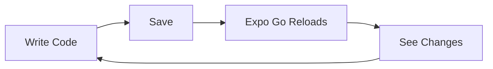
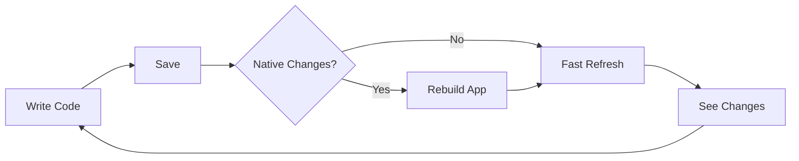

Expo Go is a pre-built sandbox app that lets you try Expo and prototype apps without building native projects. It's the fastest way to get started with Expo development.

## What is Expo Go?

Expo Go is a free, open-source app available on iOS and Android that includes a pre-configured runtime with many Expo SDK modules built-in. It allows you to load and run Expo projects by scanning a QR code.

<CardGroup cols={2}>
  <Card title="Instant Preview" icon="bolt">
    Scan a QR code and see your app running in seconds
  </Card>
  
  <Card title="No Build Required" icon="circle-xmark">
    Skip Xcode and Android Studio setup completely
  </Card>
  
  <Card title="Hot Reload" icon="arrows-rotate">
    See changes instantly with Fast Refresh
  </Card>
  
  <Card title="50+ SDK Modules" icon="cubes">
    Camera, Location, Sensors, and more included
  </Card>
</CardGroup>

## Installation

Download Expo Go from your device's app store:

<CardGroup cols={2}>
  <Card title="iOS" icon="apple" href="https://apps.apple.com/app/expo-go/id982107779">
    Download from the App Store
  </Card>
  
  <Card title="Android" icon="android" href="https://play.google.com/store/apps/details?id=host.exp.exponent">
    Download from Google Play
  </Card>
</CardGroup>

## How to Use Expo Go

<Steps>

<Step title="Create or open a project">
  ```bash
  npx create-expo-app my-app
  cd my-app
  ```
</Step>

<Step title="Start development server">
  ```bash
  npx expo start
  ```
</Step>

<Step title="Scan QR code">
  - **iOS**: Use the Camera app to scan the QR code
  - **Android**: Open Expo Go and tap "Scan QR code"
</Step>

<Step title="App loads in Expo Go">
  Your app opens and connects to the development server
</Step>

</Steps>

<Info>
  Your device and computer must be on the same WiFi network. If they're not, use `npx expo start --tunnel`.
</Info>

## What's Included

Expo Go comes with these SDK modules pre-installed:

### Core Modules

- **expo-asset** - Asset loading system
- **expo-constants** - App and device constants
- **expo-file-system** - File system access
- **expo-font** - Custom fonts
- **expo-keep-awake** - Prevent screen sleep

### Device Features

- **expo-camera** - Camera access
- **expo-location** - GPS and location
- **expo-sensors** - Accelerometer, gyroscope, magnetometer
- **expo-battery** - Battery information
- **expo-device** - Device information
- **expo-brightness** - Screen brightness control

### Media & UI

- **expo-image** - Optimized image component
- **expo-image-picker** - Select photos and videos
- **expo-video** - Video playback
- **expo-audio** - Audio playback and recording
- **expo-blur** - Blur effects
- **expo-glass-effect** - Glass morphism (iOS 18+)
- **expo-symbols** - SF Symbols (iOS)

### Storage & Network

- **expo-sqlite** - SQLite database
- **expo-secure-store** - Encrypted storage
- **expo-network** - Network information
- **expo-linking** - Deep linking

### Authentication

- **expo-auth-session** - OAuth flows
- **expo-apple-authentication** - Sign in with Apple
- **expo-local-authentication** - Biometric auth

### Utilities

- **expo-barcode-scanner** - Scan barcodes and QR codes
- **expo-clipboard** - Clipboard access
- **expo-haptics** - Haptic feedback
- **expo-web-browser** - In-app browser
- **expo-sharing** - Share content
- **expo-calendar** - Calendar access
- **expo-contacts** - Contacts access

<Accordion title="See full module list">
  
For a complete list of modules included in Expo Go, see the [Expo SDK documentation](https://docs.expo.dev/versions/latest/).

Note: The exact list depends on the Expo SDK version. Expo Go typically includes the latest stable SDK.

</Accordion>

## Limitations

Expo Go has important limitations you should understand:

<Warning>
  **Cannot add custom native code**
  
  You cannot:
  - Add custom Swift/Kotlin/Objective-C/Java code
  - Modify native project files (Info.plist, AndroidManifest.xml)
  - Change native build settings
  - Add custom CocoaPods or Gradle dependencies
</Warning>

<Warning>
  **Limited to included modules**
  
  You can only use:
  - Modules pre-installed in Expo Go
  - Pure JavaScript libraries
  - React Native core components
  
  You cannot use:
  - Third-party native libraries (unless in Expo Go)
  - Custom native modules
  - Many popular React Native libraries
</Warning>

<Warning>
  **Configuration restrictions**
  
  Some app.json settings don't apply in Expo Go:
  - App icon and splash screen (uses Expo Go branding)
  - Bundle identifier / package name
  - Native permissions (uses Expo Go's permissions)
  - Push notification configuration
</Warning>

### What You Can't Do

- Use `react-native-firebase`
- Add custom fonts via native configuration
- Use native payment SDKs
- Integrate analytics that require native code
- Use libraries with native dependencies not in Expo Go
- Test app icons and splash screens
- Test push notifications with your own credentials

## When to Use Expo Go

<Check>
  **Perfect for:**
  
  - Learning Expo and React Native
  - Rapid prototyping
  - Demos and presentations
  - Quick testing on device
  - Tutorials and workshops
  - Apps using only Expo SDK modules
</Check>

<Warning>
  **Not suitable for:**
  
  - Production apps
  - Apps requiring custom native code
  - Apps using third-party native libraries
  - Testing platform-specific features
  - Apps with specific branding requirements
  - Complex native integrations
</Warning>

## Transitioning from Expo Go

When you outgrow Expo Go, transition to development builds:

### Option 1: Local Development Build

<Steps>

<Step title="Generate native projects">
  ```bash
  npx expo prebuild
  ```
  
  This creates `ios/` and `android/` directories.
</Step>

<Step title="Install dependencies">
  ```bash
  # iOS
  npx pod-install
  
  # Android (automatic)
  ```
</Step>

<Step title="Run on device/simulator">
  ```bash
  npx expo run:ios
  npx expo run:android
  ```
</Step>

</Steps>

### Option 2: EAS Build (Cloud)

<Steps>

<Step title="Install EAS CLI">
  ```bash
  npm install -g eas-cli
  ```
</Step>

<Step title="Configure EAS">
  ```bash
  eas build:configure
  ```
</Step>

<Step title="Create development build">
  ```bash
  eas build --profile development --platform ios
  eas build --profile development --platform android
  ```
</Step>

<Step title="Install on device">
  Download and install the build on your device
</Step>

</Steps>

<Info>
  Development builds work just like Expo Go, but with your exact dependencies and configuration.
</Info>

## Development Workflow Comparison

### Expo Go



**Pros:**
- Instant setup
- No build process
- Fast iteration
- Easy sharing

**Cons:**
- Module limitations
- No custom native code
- Can't test final app

### Development Build



**Pros:**
- Any native module
- Custom native code
- Full configuration
- Test production features

**Cons:**
- Requires build step
- Longer setup time
- Need native tools (or EAS)

## Common Scenarios

<AccordionGroup>

<Accordion title="Can I use Expo Go for production?" icon="circle-question">
  
No. Expo Go is a development tool only. For production:

1. Create a development build or use `expo prebuild`
2. Build for production with EAS Build or locally
3. Submit to app stores

Your production app will be standalone, not running in Expo Go.

</Accordion>

<Accordion title="How do I add a library not in Expo Go?" icon="plus">
  
You need to create a development build:

```bash
# Install the library
npx expo install react-native-library

# Generate native projects
npx expo prebuild

# Build and run
npx expo run:ios
```

Or use EAS Build to build in the cloud.

</Accordion>

<Accordion title="Can I share my app with others using Expo Go?" icon="share">
  
Yes! If your app works in Expo Go, others can try it:

1. Publish your app:
   ```bash
   eas update
   ```

2. Share the URL or QR code

3. They scan with Expo Go

This only works if your app doesn't use custom native code.

</Accordion>

<Accordion title="Why does my app work in Expo Go but not in production?" icon="triangle-exclamation">
  
Common reasons:

- Using development-only features
- Hardcoded localhost URLs
- Missing permissions in app.json
- Environment-specific code
- Different bundle identifiers

Always test with a development build before production.

</Accordion>

</AccordionGroup>

## Debugging in Expo Go

### Developer Menu

Access the developer menu by:

- **iOS**: Shake device or press Cmd+D (simulator)
- **Android**: Shake device or press Cmd+M / Ctrl+M (emulator)
- **Terminal**: Press `m` where `expo start` is running

**Menu options:**

- Reload
- Toggle Element Inspector
- Toggle Performance Monitor  
- Debug Remote JS (legacy)
- Open React DevTools

### Console Logs

View logs in multiple places:

1. **Terminal** where you ran `expo start`
2. **React DevTools** (press `j` in terminal)
3. **Expo Go app** (shake device, tap "Show Dev Menu", "Debug Remote JS")

```tsx
console.log('Info message');
console.warn('Warning message');
console.error('Error message');
```

### Element Inspector

1. Shake device
2. Tap "Toggle Element Inspector"
3. Tap any UI element to inspect

## Tips & Tricks

<AccordionGroup>

<Accordion title="Speed up development" icon="bolt">
  
- Enable Fast Refresh (on by default)
- Keep Expo Go open between changes
- Use `r` to manually reload if needed
- Clear Metro cache if things seem broken:
  ```bash
  npx expo start --clear
  ```

</Accordion>

<Accordion title="Test on multiple devices" icon="mobile">
  
1. Start dev server: `npx expo start`
2. Open Expo Go on multiple devices
3. Scan the same QR code
4. All devices update together!

</Accordion>

<Accordion title="Work offline" icon="wifi">
  
Expo Go requires network connection to load apps. For offline development:

1. Create a development build
2. Load the build on your device
3. Develop offline (build includes all code)

</Accordion>

<Accordion title="Share with team" icon="users">
  
Share your app easily:

1. Run `eas update` to publish
2. Share the project URL
3. Team members scan with Expo Go
4. Everyone sees the same version

</Accordion>

</AccordionGroup>

## Next Steps

<CardGroup cols={2}>
  <Card title="Development Workflow" icon="code" href="/core-concepts/development-workflow">
    Master the development cycle
  </Card>
  
  <Card title="Create a Project" icon="folder-plus" href="/tutorial/create-project">
    Build your first app
  </Card>
  
  <Card title="Development Builds" icon="hammer" href="https://docs.expo.dev/develop/development-builds/">
    Go beyond Expo Go
  </Card>
  
  <Card title="Build & Deploy" icon="rocket" href="/tutorial/build-and-deploy">
    Ship to production
  </Card>
</CardGroup>
