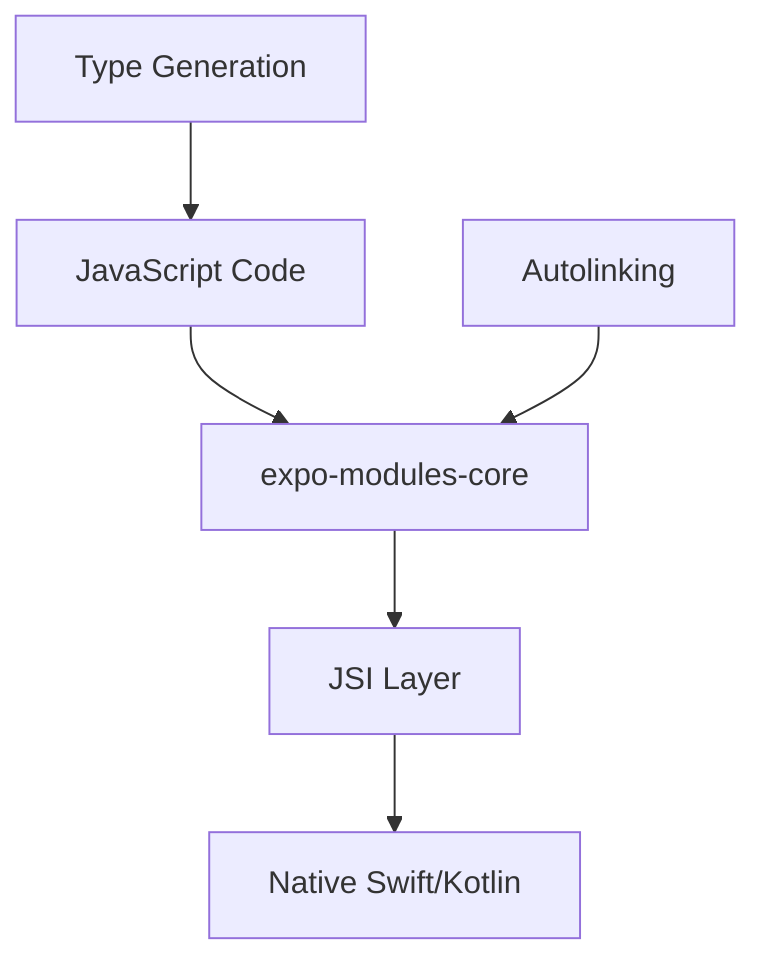

Expo Modules is a native module system that makes it easy to write native code that works seamlessly across iOS and Android. It powers all Expo SDK modules and is available for your custom native code.

## What are Expo Modules?

Expo Modules provide a modern, type-safe API for writing native modules. Instead of writing separate bridging code for React Native's legacy bridge, you write native code once using the Expo Modules API.

<CardGroup cols={2}>
  <Card title="Type Safety" icon="shield-check">
    TypeScript types are automatically generated from native code definitions
  </Card>
  
  <Card title="Cross-Platform" icon="arrows-split-up-and-left">
    Write native APIs once, works on both iOS and Android
  </Card>
  
  <Card title="Auto-linking" icon="link">
    Modules are automatically discovered and linked into your app
  </Card>
  
  <Card title="Modern APIs" icon="star">
    Uses Swift for iOS and Kotlin for Android, leveraging modern language features
  </Card>
</CardGroup>

## Architecture

### expo-modules-core

The `expo-modules-core` package is the foundation of the Expo Modules system. It provides:

- **Native Module API**: High-level APIs for defining modules in Swift/Kotlin
- **Autolinking**: Automatic discovery and registration of modules
- **Type Generation**: Automatic TypeScript type definitions
- **JSI Integration**: Direct JavaScript ↔ Native communication (no bridge)

**Key Components:**



### Module Structure

Every Expo module has this structure:

```bash
expo-example-module/
├── android/
│   └── src/main/java/expo/modules/example/
│       └── ExampleModule.kt          # Android implementation
├── ios/
│   └── ExampleModule.swift             # iOS implementation
├── src/
│   ├── ExampleModule.ts              # JavaScript interface
│   └── ExampleModule.types.ts        # TypeScript types (auto-generated)
├── expo-module.config.json         # Module configuration
└── package.json
```

## Creating an Expo Module

### Quick Start

Use the official tool to scaffold a new module:

```bash
npx create-expo-module my-module
```

This creates a complete module with:
- iOS and Android native implementations
- TypeScript definitions
- Example app for testing
- Autolinking configuration

### Module Configuration

The `expo-module.config.json` defines module metadata:

```json expo-module.config.json
{
  "platforms": ["ios", "android"],
  "ios": {
    "modules": ["ExampleModule"]
  },
  "android": {
    "modules": ["expo.modules.example.ExampleModule"]
  }
}
```

## Writing Native Code

### iOS (Swift)

Expo modules use a declarative Swift DSL:

```swift ios/ExampleModule.swift
import ExpoModulesCore

public class ExampleModule: Module {
  // Define module name
  public func definition() -> ModuleDefinition {
    Name("Example")

    // Define a function callable from JavaScript
    Function("hello") { (name: String) -> String in
      return "Hello \(name)!"
    }

    // Define an async function
    AsyncFunction("fetchData") { (url: String) -> [String: Any] in
      // Perform async operation
      let data = await fetchFromNetwork(url)
      return data
    }

    // Define a property
    Property("language")
      .get { "Swift" }

    // Define events
    Events("onChange", "onError")

    // Define a view component
    View(ExampleView.self) {
      Prop("color") { (view: ExampleView, color: UIColor) in
        view.backgroundColor = color
      }

      Events("onPress")
    }
  }
}
```

**Key Swift APIs:**

- `Name()` - Module name exposed to JavaScript
- `Function()` - Synchronous function
- `AsyncFunction()` - Async function (returns Promise)
- `Property()` - Getter/setter for module property
- `Events()` - Event emitter names
- `View()` - Native UI component
- `Prop()` - Component prop definition

### Android (Kotlin)

Android modules use a similar Kotlin DSL:

```kotlin android/src/main/java/expo/modules/example/ExampleModule.kt
package expo.modules.example

import expo.modules.kotlin.modules.Module
import expo.modules.kotlin.modules.ModuleDefinition

class ExampleModule : Module() {
  override fun definition() = ModuleDefinition {
    // Define module name
    Name("Example")

    // Define a function
    Function("hello") { name: String ->
      "Hello $name!"
    }

    // Define an async function
    AsyncFunction("fetchData") { url: String ->
      // Perform async operation
      val data = fetchFromNetwork(url)
      data
    }

    // Define a property
    Property("language")
      .get { "Kotlin" }

    // Define events
    Events("onChange", "onError")

    // Define a view component
    View(ExampleView::class) {
      Prop("color") { view: ExampleView, color: Int ->
        view.setBackgroundColor(color)
      }

      Events("onPress")
    }
  }
}
```

## JavaScript Interface

The JavaScript side defines the public API:

```typescript src/ExampleModule.ts
import { NativeModulesProxy, EventEmitter } from 'expo-modules-core';

// Access native module
const ExampleModule = NativeModulesProxy.Example;

// Synchronous function
export function hello(name: string): string {
  return ExampleModule.hello(name);
}

// Async function
export async function fetchData(url: string): Promise<any> {
  return await ExampleModule.fetchData(url);
}

// Property access
export const language = ExampleModule.language;

// Event emitter
const emitter = new EventEmitter(ExampleModule);

export function addChangeListener(listener: (event: any) => void) {
  return emitter.addListener('onChange', listener);
}
```

## React Components

Create native UI components:

### iOS View

```swift ios/ExampleView.swift
import ExpoModulesCore
import UIKit

class ExampleView: ExpoView {
  private let label = UILabel()
  
  required init(appContext: AppContext? = nil) {
    super.init(appContext: appContext)
    
    addSubview(label)
    label.textAlignment = .center
  }
  
  override func layoutSubviews() {
    super.layoutSubviews()
    label.frame = bounds
  }
}
```

### Android View

```kotlin android/src/main/java/expo/modules/example/ExampleView.kt
package expo.modules.example

import android.content.Context
import android.widget.TextView
import expo.modules.kotlin.views.ExpoView

class ExampleView(context: Context) : ExpoView(context) {
  private val textView = TextView(context).apply {
    textAlignment = TextView.TEXT_ALIGNMENT_CENTER
  }
  
  init {
    addView(textView)
  }
}
```

### React Component

```tsx src/ExampleView.tsx
import { requireNativeViewManager } from 'expo-modules-core';
import * as React from 'react';
import { ViewProps } from 'react-native';

const NativeView = requireNativeViewManager('Example');

export interface ExampleViewProps extends ViewProps {
  color?: string;
  onPress?: () => void;
}

export default function ExampleView(props: ExampleViewProps) {
  return <NativeView {...props} />;
}
```

## Autolinking

Expo modules are automatically linked using `expo-modules-autolinking`.

### How Autolinking Works

<Steps>

<Step title="Module installed">
  Install module: `npx expo install expo-example-module`
</Step>

<Step title="Build triggered">
  Run `npx expo prebuild` or build command
</Step>

<Step title="Autolinking scans">
  Scans `node_modules` for packages with `expo-module.config.json`
</Step>

<Step title="Native config generated">
  Generates iOS Podfile and Android Gradle config
</Step>

<Step title="Module registered">
  Module is automatically registered in the app
</Step>

</Steps>

### iOS Autolinking

In your `Podfile`:

```ruby ios/Podfile
require File.join(File.dirname(`node --print "require.resolve('expo-modules-core/package.json')"`), "cocoapods.rb")
require File.join(File.dirname(`node --print "require.resolve('expo-modules-core/package.json')"`), "scripts/autolinking")

target 'MyApp' do
  use_unimodules!
  # Expo modules are automatically included here
end
```

### Android Autolinking

In your `settings.gradle`:

```groovy android/settings.gradle
apply from: new File(["node", "--print", "require.resolve('expo-modules-core/package.json')"].execute(null, rootDir).text.trim(), "../gradle.groovy");
includeUnimodulesProjects()
```

In your `app/build.gradle`:

```groovy android/app/build.gradle
apply from: new File(["node", "--print", "require.resolve('expo-modules-core/package.json')"].execute(null, rootDir).text.trim(), "../gradle.groovy")
```

## Real-World Examples

### expo-battery

A simple module that reads battery level:

**iOS:**
```swift
import ExpoModulesCore
import UIKit

public class BatteryModule: Module {
  public func definition() -> ModuleDefinition {
    Name("ExpoBattery")

    AsyncFunction("getBatteryLevelAsync") { () -> Float in
      UIDevice.current.isBatteryMonitoringEnabled = true
      return UIDevice.current.batteryLevel
    }

    AsyncFunction("getBatteryStateAsync") { () -> Int in
      UIDevice.current.isBatteryMonitoringEnabled = true
      return UIDevice.current.batteryState.rawValue
    }
  }
}
```

**JavaScript:**
```typescript
export async function getBatteryLevelAsync(): Promise<number> {
  return await ExpoBattery.getBatteryLevelAsync();
}
```

### expo-camera

A complex module with native views and permissions:

**Module Definition:**
```swift
public class CameraModule: Module {
  public func definition() -> ModuleDefinition {
    Name("ExpoCamera")

    AsyncFunction("requestCameraPermissionsAsync") {
      // Permission handling
    }

    View(CameraView.self) {
      Events("onCameraReady", "onPictureSaved")
      
      Prop("type") { (view: CameraView, type: Int) in
        view.updateCameraType(type)
      }

      AsyncFunction("takePicture") { (view: CameraView, options: [String: Any]) in
        return try await view.takePicture(options)
      }
    }
  }
}
```

## Type Safety

Expo Modules automatically generate TypeScript types:

```typescript src/ExampleModule.types.ts
// Auto-generated from native code
export type ExampleModuleEvents = {
  onChange: { value: string };
  onError: { message: string };
};

export interface ExampleModule {
  hello(name: string): string;
  fetchData(url: string): Promise<Record<string, any>>;
  readonly language: string;
}
```

## Testing Modules

The create-expo-module tool includes an example app:

```bash
cd example
npm install
npx expo start
```

Test your module in the example app before publishing.

## Best Practices

<AccordionGroup>

<Accordion title="Use Async Functions" icon="hourglass">
  Prefer `AsyncFunction` over `Function` for operations that might take time. This prevents blocking the JavaScript thread.

  ```swift
  // Good
  AsyncFunction("fetchData") { (url: String) in
    return await fetch(url)
  }

  // Avoid
  Function("fetchData") { (url: String) in
    return fetch(url) // Blocks JS thread!
  }
  ```
</Accordion>

<Accordion title="Handle Errors Gracefully" icon="triangle-exclamation">
  Use proper error handling and throw descriptive errors:

  ```swift
  AsyncFunction("readFile") { (path: String) throws -> String in
    guard FileManager.default.fileExists(atPath: path) else {
      throw FileNotFoundException()
    }
    return try String(contentsOfFile: path)
  }
  ```
</Accordion>

<Accordion title="Type Everything" icon="shield">
  Specify all types explicitly for better auto-generated TypeScript types:

  ```swift
  // Good - explicit types
  Function("add") { (a: Int, b: Int) -> Int in
    return a + b
  }

  // Avoid - implicit types
  Function("add") { (a, b) in
    return a + b
  }
  ```
</Accordion>

<Accordion title="Clean Up Resources" icon="broom">
  Implement proper cleanup for views and listeners:

  ```swift
  class ExampleView: ExpoView {
    private var observer: NSObjectProtocol?

    deinit {
      if let observer = observer {
        NotificationCenter.default.removeObserver(observer)
      }
    }
  }
  ```
</Accordion>

</AccordionGroup>

## Common Patterns

### Permissions

```swift
import ExpoModulesCore

public class ExampleModule: Module {
  public func definition() -> ModuleDefinition {
    Name("Example")

    AsyncFunction("requestPermissions") {
      return await EXPermissionsMethodsDelegate.requestPermission(
        withPermissionsManager: appContext?.permissions,
        requester: CameraPermissionRequester.self
      )
    }
  }
}
```

### Events

```swift
public class ExampleModule: Module {
  public func definition() -> ModuleDefinition {
    Name("Example")
    
    Events("onChange")

    Function("startWatching") {
      // Send events
      sendEvent("onChange", [
        "value": "new value"
      ])
    }
  }
}
```

### Native Views

```swift
View(ExampleView.self) {
  // Props
  Prop("text") { (view: ExampleView, text: String) in
    view.label.text = text
  }

  // Events
  Events("onPress")

  // Methods
  AsyncFunction("capture") { (view: ExampleView) -> String in
    return await view.captureImage()
  }
}
```

## Next Steps

<CardGroup cols={2}>
  <Card title="Architecture" icon="diagram-project" href="/core-concepts/architecture">
    Understand how all pieces fit together
  </Card>
  
  <Card title="Development Workflow" icon="code" href="/core-concepts/development-workflow">
    Learn the development cycle
  </Card>
  
  <Card title="Create a Module" icon="plus" href="https://docs.expo.dev/modules/">
    Build your first Expo module
  </Card>
  
  <Card title="Tutorial" icon="graduation-cap" href="/tutorial/create-project">
    Build a complete app
  </Card>
</CardGroup>
