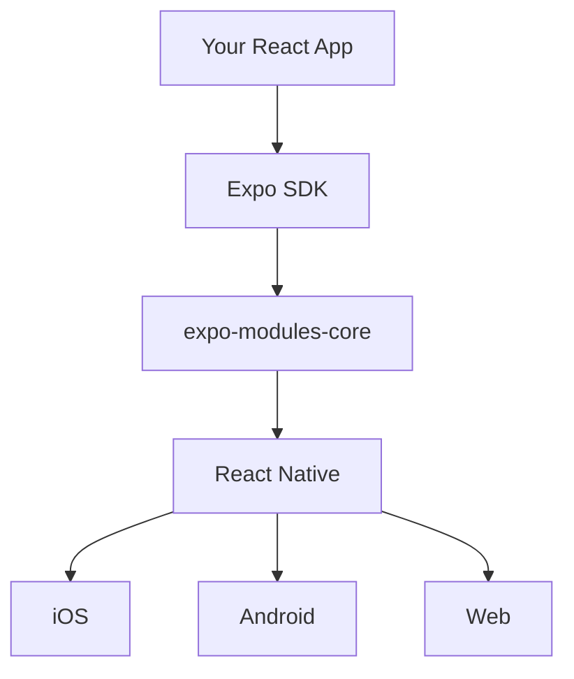

Expo is an open-source platform for making universal native apps that run on Android, iOS, and the web. It includes a universal runtime and libraries that let you build native apps by writing React and JavaScript.

## What is Expo?

Expo provides a complete development environment that lets you build, deploy, and iterate on native apps without needing deep knowledge of native development tools like Xcode or Android Studio. Whether you're a solo developer or part of a team, Expo streamlines the entire mobile development workflow.

<CardGroup cols={2}>
  <Card title="Write Once, Run Everywhere" icon="mobile">
    Build apps that work seamlessly across iOS, Android, and web from a single codebase using React Native.
  </Card>
  
  <Card title="Native Module System" icon="puzzle-piece">
    Access native platform features through a modular architecture powered by expo-modules-core.
  </Card>
  
  <Card title="File-Based Routing" icon="route">
    Use Expo Router for automatic navigation setup based on your file structure.
  </Card>
  
  <Card title="Development Tools" icon="wrench">
    Fast Refresh, instant previews, and a powerful CLI make development seamless.
  </Card>
</CardGroup>

## Key Features

### Universal Runtime

Expo provides a consistent runtime environment across all platforms. Your app's JavaScript code runs the same way on iOS, Android, and web, with platform-specific optimizations handled automatically.

### Expo SDK

The Expo SDK includes 50+ modules that provide access to device capabilities:

- **Camera & Media**: Camera, Image Picker, Audio, Video
- **Device Features**: Location, Sensors, Haptics, Battery
- **UI Components**: Blur, Glass Effect, Symbols, System UI
- **Storage & Network**: FileSystem, SQLite, Network, SecureStore
- **Authentication**: Apple, Google, Auth Session

### Expo CLI

The Expo CLI (`@expo/cli`) is your command center for development:

```bash
npx expo start      # Start development server
npx expo run:ios    # Build and run on iOS
npx expo run:android # Build and run on Android
npx expo prebuild   # Generate native projects
npx expo install    # Install compatible packages
```

### Expo Router

File-based routing for React Native apps with deep linking, type safety, and cross-platform navigation:

```bash
app/
  _layout.tsx       # Root layout
  index.tsx         # Home screen → /
  profile/
    [id].tsx        # Dynamic route → /profile/:id
  (tabs)/
    _layout.tsx     # Tab navigation
    home.tsx        # Tab screen → /home
    settings.tsx    # Tab screen → /settings
```

## Use Cases

<AccordionGroup>
  <Accordion title="Startups & MVPs" icon="lightbulb">
    Rapidly prototype and launch apps across all platforms without maintaining separate codebases. Get to market faster with hot reload and over-the-air updates.
  </Accordion>
  
  <Accordion title="Enterprise Applications" icon="building">
    Build internal tools, customer-facing apps, and business solutions with enterprise-grade security, offline support, and native performance.
  </Accordion>
  
  <Accordion title="Cross-Platform Products" icon="globe">
    Maintain a single codebase for iOS, Android, and web while delivering platform-specific experiences where needed.
  </Accordion>
  
  <Accordion title="Learning & Education" icon="graduation-cap">
    Perfect for developers learning React Native. Start building immediately without iOS or Android development setup.
  </Accordion>
</AccordionGroup>

## How Expo Works

Expo sits on top of React Native, providing three main layers:

1. **Expo Modules Core**: A native module API that makes it easy to write native code that works on iOS and Android
2. **Expo SDK**: Pre-built modules for common features like camera, location, notifications
3. **Development Tools**: CLI, Dev Server, Metro bundler integration, and native build orchestration



## Expo Go vs Development Builds

<Note>
  Expo offers two ways to develop your app:
</Note>

### Expo Go

A pre-built app with common Expo SDK modules built-in. Perfect for learning and prototyping.

**Pros:**
- No native build required
- Instant preview via QR code
- Fastest way to get started

**Limitations:**
- Limited to included SDK modules
- Cannot add custom native code
- No third-party native libraries

### Development Builds

Custom builds of your app with your exact dependencies.

**Pros:**
- Include any native library
- Custom native code
- Full control over capabilities

**Use when:**
- Adding custom native modules
- Using libraries not in Expo Go
- Building for production

## Getting Started

<CardGroup cols={2}>
  <Card title="Quick Start" icon="bolt" href="/quickstart">
    Create your first Expo app in 5 minutes
  </Card>
  
  <Card title="Installation" icon="download" href="/installation">
    Complete installation and setup guide
  </Card>
  
  <Card title="Core Concepts" icon="book" href="/core-concepts/architecture">
    Understand how Expo works under the hood
  </Card>
  
  <Card title="Tutorial" icon="graduation-cap" href="/tutorial/create-project">
    Build your first app step-by-step
  </Card>
</CardGroup>

## Community & Support

Join thousands of developers building with Expo:

- **Discord**: Chat with the community at [chat.expo.dev](https://chat.expo.dev)
- **GitHub**: Contribute to the [expo/expo](https://github.com/expo/expo) repository
- **Forums**: Ask questions and share knowledge
- **Documentation**: Comprehensive guides in this documentation site

<Note>
  Expo is MIT licensed and maintained by Expo (the company) with contributions from developers worldwide.
</Note>

## Next Steps

Ready to start building? Here's what to do next:

<Steps>
  <Step title="Try the Quickstart">
    Follow our [5-minute quickstart](/quickstart) to create and run your first app
  </Step>
  
  <Step title="Learn Core Concepts">
    Understand [Expo's architecture](/core-concepts/architecture) and how everything fits together
  </Step>
  
  <Step title="Build a Real App">
    Follow the [step-by-step tutorial](/tutorial/create-project) to build a complete application
  </Step>
  
  <Step title="Explore the SDK">
    Browse the [API Reference](/sdk/overview) to discover what's possible
  </Step>
</Steps>
